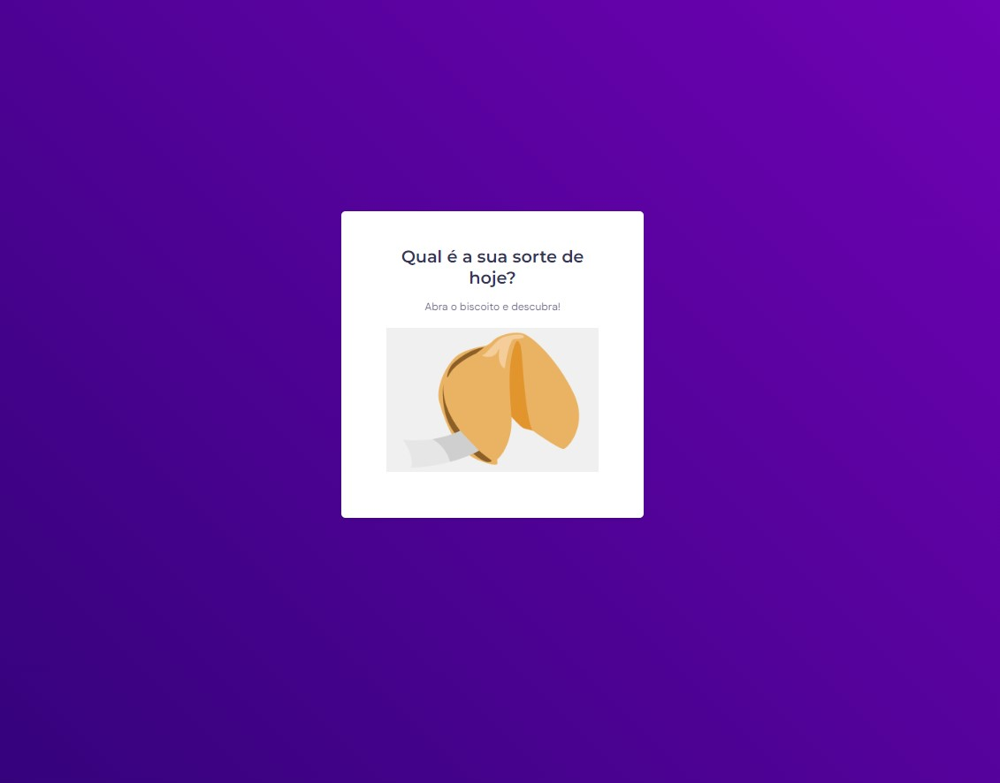

<h1 align="center"> Projeto Biscoito da Sorte </h1>

Programa exclusivo e gratuito, promovido pela Rocketseat para ensino de tecnologias WEB.

  <a href="#-tecnologias">Tecnologias</a>&nbsp;&nbsp;&nbsp;|&nbsp;&nbsp;&nbsp;
  <a href="#-projeto">Projeto</a>&nbsp;&nbsp;&nbsp;|&nbsp;&nbsp;&nbsp;
  <a href="#-layout">Layout</a>&nbsp;&nbsp;&nbsp;|&nbsp;&nbsp;&nbsp;
  <a href="#memo-licença">Licença</a>

  

 

## 🚀 Tecnologias

Esse projeto foi desenvolvido com as seguintes tecnologias:

- HTML e CSS
- JavaScript
- Git e Github
- Figma

## 💻 Projeto

O Biscoito da Sorte é um projeto extra proposto no bootcamp da Rocketseat, onde o usuario deve abrir o biscoito da sorte, exibindo uma das possiveis mensagens da sorte.

Vamos ver a sua ???

Você pode visualizar o projeto através [DESSE LINK](https://gbenini.github.io/fortune-cookie-project/) 👀

## 🔖 Layout

Você pode visualizar o layout do projeto através [DESSE LINK](https://www.figma.com/file/LsD7jJznyuSmuYbAIxG70q/Biscoito-da-Sorte-(Community)?type=design&node-id=0-1&mode=design&t=1j4mikGKBgijfxik-0). É necessário ter conta no [Figma](https://figma.com) para acessá-lo.

## :memo: Licença

Esse projeto está sob a licença MIT.

---

Feito com ♥ by GBenini e Rocketseat :wave: [Participe da nossa comunidade!](https://discord.gg/rocketseat)